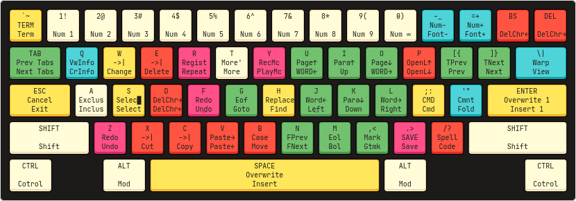
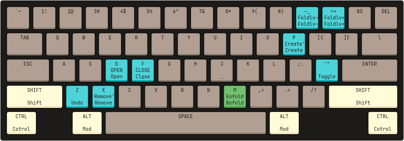

    

## About

This is a port of [Bkey](https://github.com/SakashiNNB/bkey) to vim.

*(In beta)*

## Contents

  * [About](#about)
  * [Contents](#contents)
  * [Documentation](#references)
  * [TODO/FIXME](#todo%2Ffixme)

## Documentation

\#TODO

### Normal

#### Holding <kbd>CTRL</kbd>

### Goto key <kbd>G</kbd>

### Next & Previous keys <kbd>\[</kbd>, <kbd>\]</kbd>

### Spell-checks key  <kbd>SHIFT</kbd> + <kbd>/</kbd>

### Repeat key <kbd>R</kbd>

### Fold key <kbd>'</kbd>

### Views key <kbd>\\</kbd>

# TODO/FIXME

  * [ ] Idea
    * [ ] <kbd>Q</kbd>
    * [ ] <kbd>SHIFT</kbd> + <kbd>0</kbd>-<kbd>9</kbd>
    * [ ] <kbd>F1</kbd>-<kbd>F12</kbd>
  
  * [ ] Fuctions
    * [ ] <kbd>D</kbd> *(Smart delete)*
    * [ ] <kbd>SHIFT</kbd> + <kbd>M</kbd> *(Smart Bol)*
    * [ ] <kbd>ENTER</kbd> *(Insert one)*
    * [ ] Move line with count
    * [ ] Fix line-wrap movement: when move to the left at bol it move into the last character (before it) of the upper line but not after the character
    * [ ] Fix visual mode movement: move to end of word when the cursor is before the selection is move not correct
    * [ ] Fix visual-block mode
  
  * [ ] Make full doc
  * [ ] Support for other plug-ins
